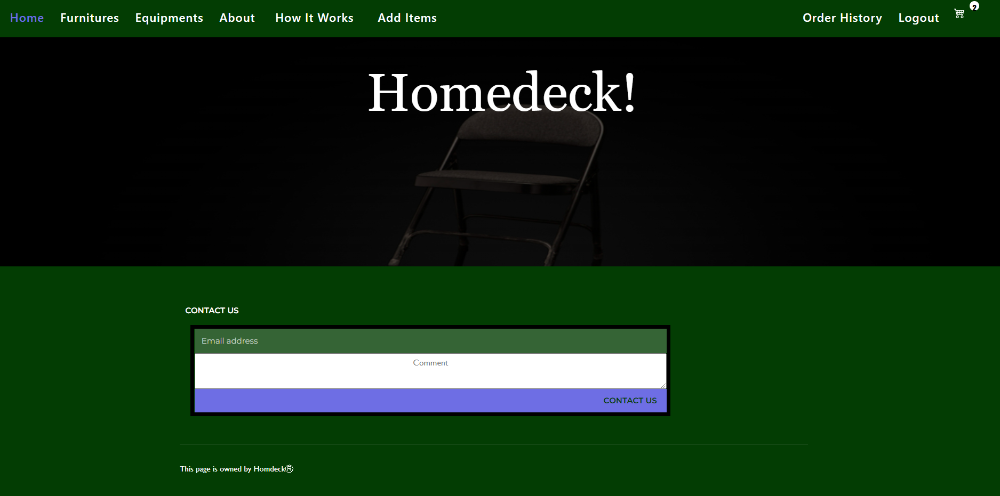
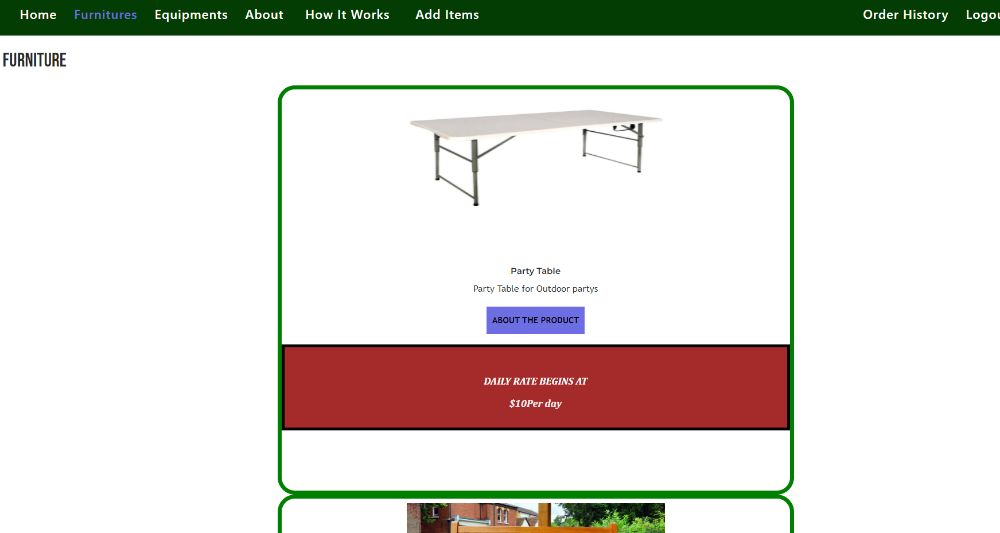
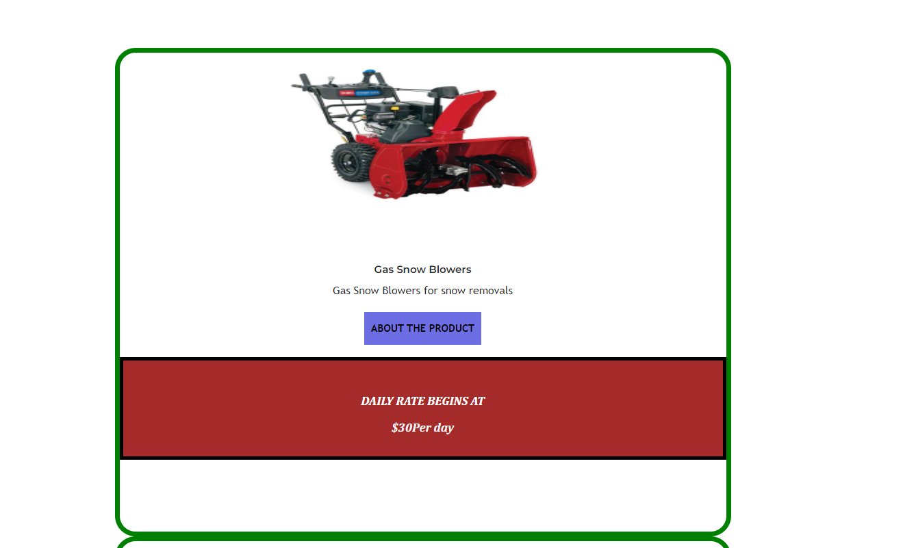
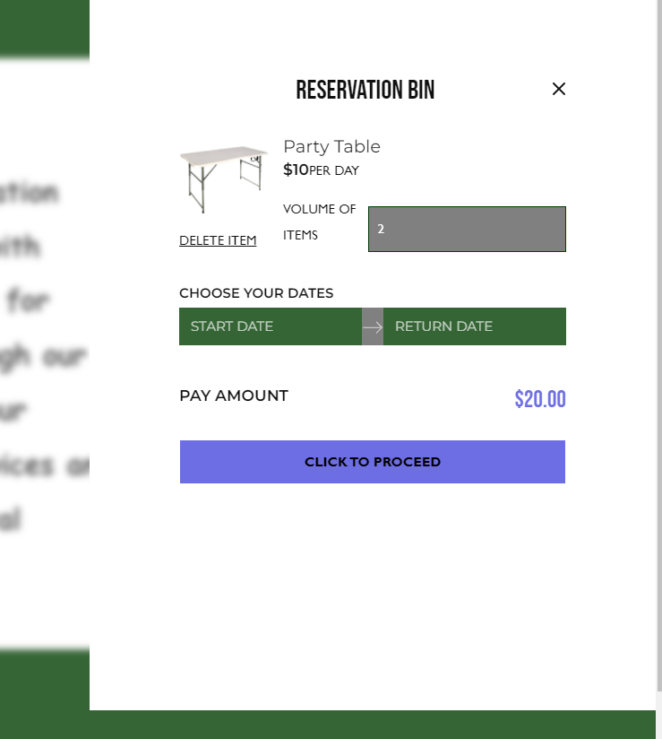
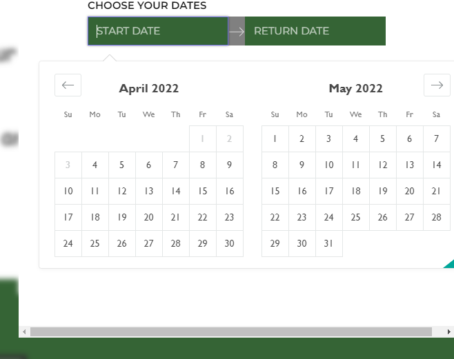

# homedeck

## Description

This is a Full Stack Application of a household item rental service with full access to users upon authentication. Users have the ability to rent household items from different categories like furniture, equipments and tools, etc.

> Github Repository Link: [https://github.com/Shaleens1994/homedeck](https://github.com/Shaleens1994/homedeck)

## Table of Contents

1. [Installation](#installation)
2. [Usage](#usage)
3. [Screenshots](#Screenshots)
4. [License](#license)
5. [Questions](#questions)

## Installation

Type "npm install" in the console to install the required dependancies.

## Usage

Click the heroku link to go to the deployed application and see its functionality

### Screenshots

