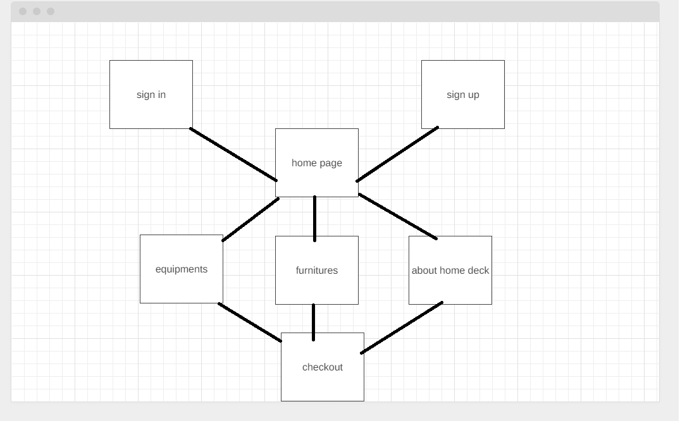
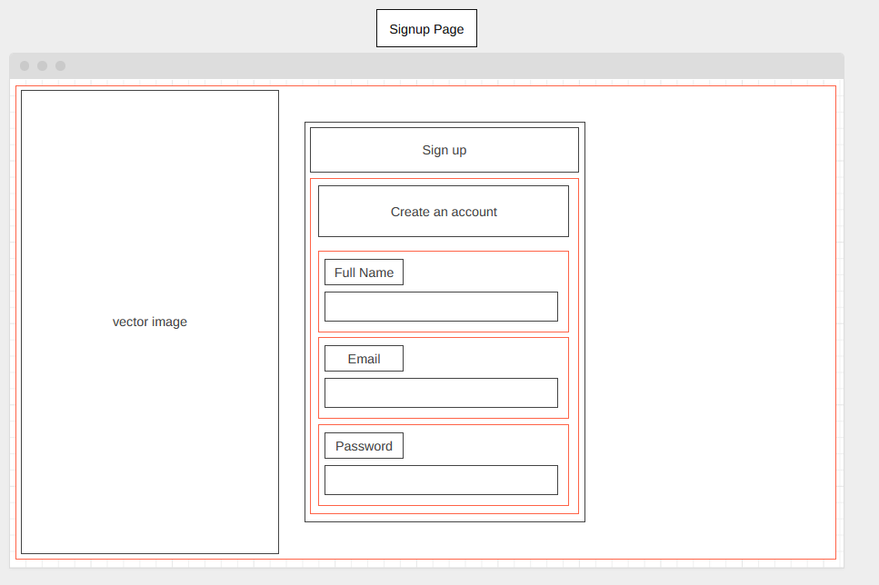

# homedeck

HOMEDECK- GROUP 5 NEVAN, ABI AND SHALEEN

User Story

AS A USER who doesn’t want to spend money on expensive one-time use items,
I WANT to be able to check out and rent these seasonal items for cheap

Project 3 for Coding Boot-Camp
1.	E commerce website to rent household items like lawn mowers, toolkits and other home items like furniture.
2.	User can rent it for days based on needs.	
3.	User needs to sign in to get into rental page
4.	Each item has a per day amount which needs to be paid and he can get the item on required time.

Technologies Employed:
•	Node.js
•	Express.js
•	MongodB
•	GraphQL
•	React
•	JWT Tokens
•	RESTful API 
•	Stripejs
•	nodemon

